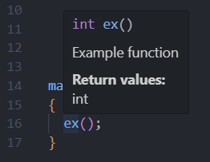

# Cal Poly SPT Pump Team
Welcome to the organization page for the Pump Team of SLO Propulsion Technologies! This is where we will be keeping all the project repositories.

## About Our Project
*Coming Soon*

## Guidelines
These are some general guidelines for best coding practices. Please try to follow them to the best of your ability so when we bring everything together into a final project it will be a smooth experience.

### Pushing Code to Organization Repositories

1. **Only Push Working Code**: Do not use this as a place to save every change you make. Ensure that you are only pushing code that is fully functional and does not break any existing functionality. DO NOT PUSH UNTESTED CODE!

2. **Push ASAP**: Once you've made substantial changes that you have ***confirmed to be working***, push them to the repository as soon as possible to keep the project up-to-date.

3. **Provide Documentation**: Write up documentation describing how your code works. I know it sucks writing documentation, but it will be really helpful for the team in the long run. It doesn't have to be anything special, at the bare minimum just give a brief summary of your code in the project `README.md` file. You don't need to know any markdown, you can just write in plaintext.

### Code Design and Formatting
1. **Incorporate Modular Designs**: Design your code in a modular fashion by breaking down functionality into smaller, self-contained units or modules (classes and libraries with helper functions). Each module should have a single responsibility and be designed to perform a specific task. This approach makes your code more manageable, easier to understand, and simpler to test. Everything we make should be designed with the goal of bringing it all together into one project in the end. You should be physically separating your code into separate files so we can pick and choose what parts to copy over to new projects.

2. **Comment All Code**: Provide comments *everywhere* in your code to explain the logic and make it easier for others to understand. It is essential that anyone else on the team can come look at your code and understand what's happening. Using the following comment block above function definitions will let VSCode do some helpful things:
   
   ```cpp
   /**
    * @brief Brief description of what the function does
    * @retval The return type of the function
    */
   ```
   When you use this comment block in VSCode, it will show you the details of your function whenever you hover over any instance of it in your code. Here's an example:

   ```cpp
   /**
    * @brief Example function
    * @retval int
    */
   int ex(void)
   {
     return 0;
   }
   ```
   When I hover over the function anywhere in my code editor this helper pop-up will appear:
   

3. **Use Size-Defined Data Types**: When working with emmbeded systems with relatively limited memory, we have to make sure we are conserving resources as best we can. This means using data types that have a well defined size, which basically means just don't use the plain `int` data type. The size of the `int` data type varies from compiler to compiler so always make sure you are using one of the length-defined `int` variations from the arduino library (`int8_t`, `int16_t`, `int32_t`) or one of their unsigned counterparts (`uint8_t`, `uint16_t`, `uint32_t`).

4. **Indentation**: This is purely an asthetics/formatting thing so it's not as important as the rest of the guidelines but it's still good practice so please try and use it when you can. Our standard will be 2-space indent, which is the same as many professional organizations. Using spaces instead of the tab character ensures that it will look the same for everyone who views it (the size of a tab depends on the computer an program displaying it). You can change the settings in VSCode to automatically insert 2 spaces when you press the tab button.
